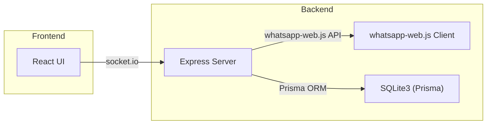

# WhatsApp Automation Prototype PRD

## 1. Purpose & Background
This document outlines the Product Requirements for a WhatsApp workflow automation prototype. It will guide junior developers through the what, why, and how.

### 1.1 Why
- Demonstrate end-to-end automation of WhatsApp tasks.
- Provide a reusable starter kit for chat-based integrations.
- Validate feasibility of UI + backend using whatsapp-web.js.

### 1.2 Audience
- Junior and mid-level developers who will build and extend the prototype.

## 2. Objectives & Success Criteria
- **Link Account**: User scans a QR to connect their WhatsApp session.
- **List Chats**: Display recent personal and group chats in a sidebar.
- **View & Send**: Show chat history; allow typing text, sending images/files.
- **Persistence**: Store session and minimal message cache in SQLite.
- **UX**: Responsive, clear status indicators (loading, ready, error).

**Success**: The user can link, view, and send messages/media within 2 clicks.

## 3. Scope & Features

### 3.1 Frontend (React + TypeScript)
- **QR Scanner**: Renders QR code from backend.
- **Chat List**: Scrollable list with unread counts.
- **Chat Window**: Conversation feed, input box, attachments.
- **State Management**: Socket events for real-time updates.

### 3.2 Backend (Node.js + TypeScript)
- **Auth**: whatsapp-web.js LocalAuth for session persistence.
- **Socket.io**: Real-time channel for QR, chats, messages.
- **API**: REST endpoints for chat history fallback.
- **Storage**: SQLite schema for sessions, chats, messages.

## 4. User Flows
1. **Launch App** ➔ Backend checks session.
   - No session ➔ emits QR ➔ frontend shows scanner.
2. **Scan QR** ➔ Backend ready ➔ emits chat list.
3. **Select Chat** ➔ fetch recent history ➔ render in window.
4. **Send Message** ➔ frontend emits sendMessage ➔ backend calls client.sendMessage ➔ persists & acknowledges.
5. **Receive Message** ➔ backend on 'message' ➔ persist & emit to frontend.

## 5. Non-Functional Requirements
- **Performance**: <500ms round trip for message send/receive in LAN.
- **Reliability**: Auto-reconnect on network drop.
- **Security**: Do not log message contents.
- **Maintainability**: Clear folder structure, TypeScript types.

## 6. Tech Stack & Dependencies
- **Language**: TypeScript (backend & frontend)
- **Frontend**: React, Vite or CRA, socket.io-client, qrcode.react
- **Backend**: Node.js, Express, socket.io, whatsapp-web.js (pedroslopez/whatsapp-web.js), sqlite3 with Prisma
- **Storage**: SQLite file in project root

## 7. Architecture Overview

---
*End of PRD.*
